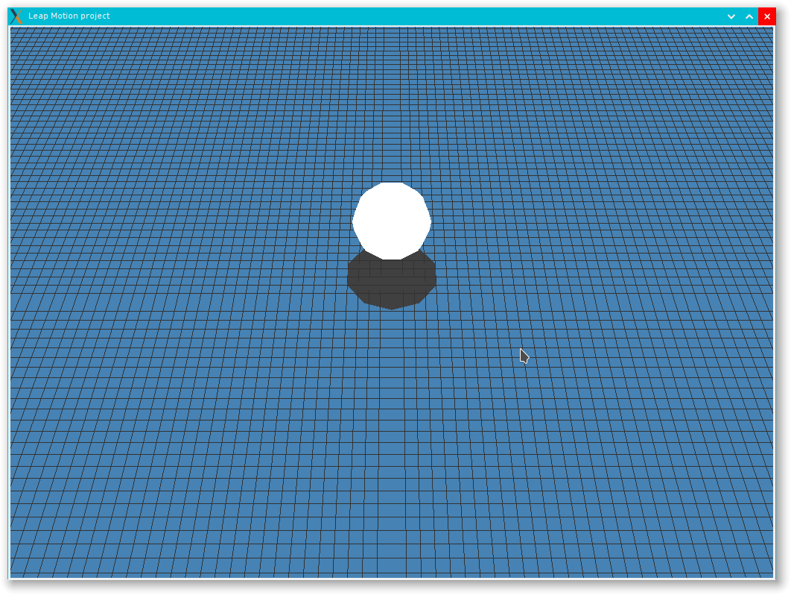
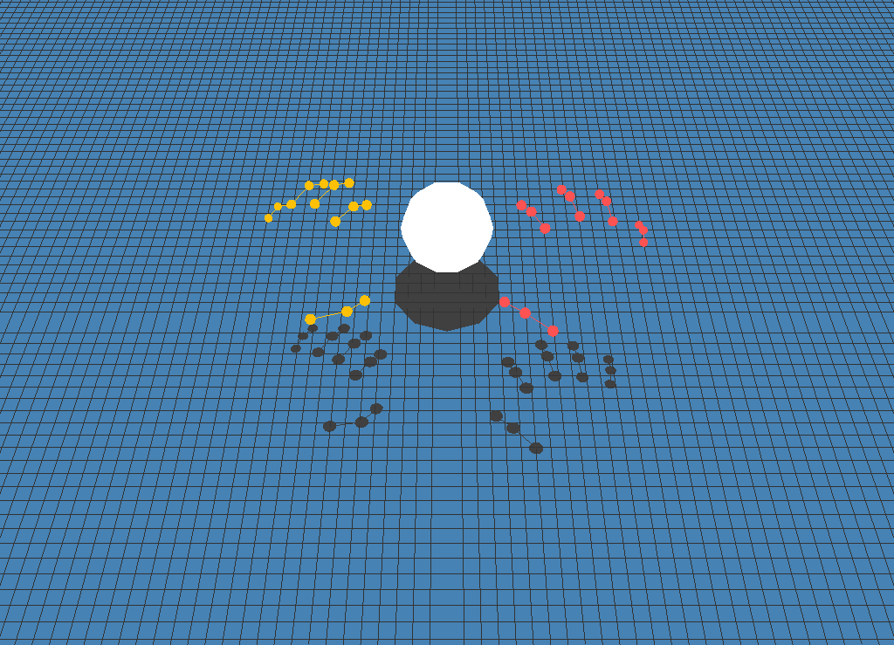
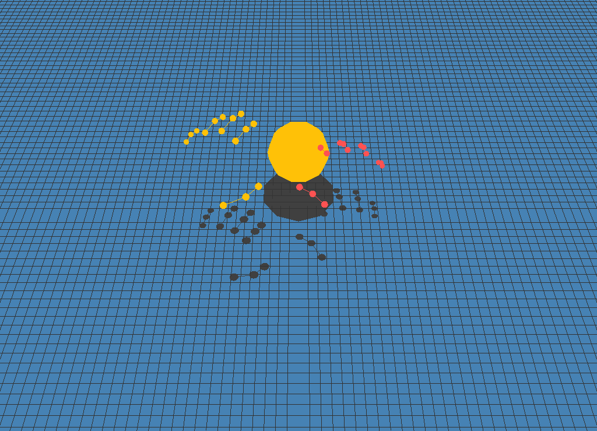

# Leap Motion project

## Introduction
This repository contains the Leap Motion project developed for the course **Nuevos Paradigmas de Interacción** at the University of Granada, Spain.

The final goal is to simulate the classical game of *las chapas*, letting the user to interact with the computer through the movement of its own hands.

### Current state
By now, just a first recognition and interaction phase has been implemented. The functionality now is simple: the scene has just a ball that changes its colour when it is touched.

## Instalation
The project is coded in Python, using the Leap Motion driver and the OpenGL library. The required dependencies are the following:

1. **Python2**
2. **Leap-Motion-Driver**
3. **Leap-Motion-SDK**
4. **Python2-OpenGL**

The most common distributions have all the library packages needed, but maybe the Leap Motion driver and SDK are not in the repositories. However, it is easy to download them from the [Download](https://developer.leapmotion.com/downloads) section of Leap Motion web page.


The [Python API](https://developer.leapmotion.com/documentation/python/index.html) could also be useful if some error appear.

If the Python OpenGL library is not in your distribution repository, use the package manager **pip** to install them.

### Arch Linux example
Arch Linux has all required packages in the official -and AUR- repositories. To install Python and OpenGL, execute the following order:
```
pacman -S python2 python2-opengl
```

[leap-motion-driver](https://aur.archlinux.org/packages/leap-motion-driver) and [leap-motion-sdk](https://aur.archlinux.org/packages/leap-motion-sdk) packages are not in the official repository but in the Arch User Repository. To install them, just build the packages manually or use a package manager like `pacaur`:

```
pacaur -S leap-motion-driver leap-motion-sdk
```

Caution! leap-motion-sdk throws an error if the pkg-build is not edited. You have to add `${pkgdir}` in the following lines
```
install -D -m644 "/usr/lib/Leap/Leap.py" "${pkgdir}/usr/lib/python2.7/site-packages/Leap.py"
install -D -m644 "/usr/lib/Leap/LeapPython.so" "${pkgdir}/usr/lib/python2.7/site-packages/LeapPython.so"
```

They have to look like this:
```
install -D -m644 "${pkgdir}/usr/lib/Leap/Leap.py" "${pkgdir}/usr/lib/python2.7/site-packages/Leap.py"
install -D -m644 "${pkgdir}/usr/lib/Leap/LeapPython.so" "${pkgdir}/usr/lib/python2.7/site-packages/LeapPython.so"
```

## Execution and usage
Connect the Leap Motion, start the daemon -with `sudo leapd`-, and execute the following order:
```
$> python2 main.py
```

You will see a scene like the following one:



What if you place your hands above the Leap Motion device? Try it!



Now, try to touch the ball, it will change its colour :)



Now, touch it with the other hand. Or even with both of them!
