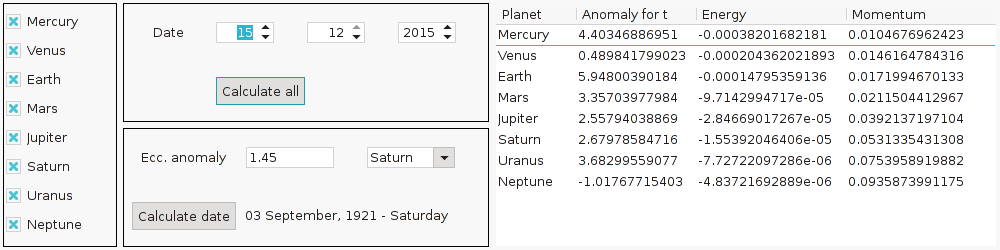

----------------------------------------------------------------

*Documentación extraída del repositorio de Github [agarciamontoro/kepler_laws](https://github.com/agarciamontoro/kepler_laws).*

# Descarga e instalación
## Dependencias
Para la correcta ejecución del programa, el sistema sobre el que se instale necesita tener las siguientes dependencias:

* OpenGL (con freeGLUT)
* SciPy
* wxPython

La mayoría de las distribuciones de Linux tienen estos paquetes en sus repositorios oficiales.

En **Ubuntu**, por ejemplo, la siguiente orden es suficiente para instalar todo lo necesario:

```
sudo apt-get install python-opengl freeglut3 python-scipy python-wxgtk2.8
```

En **Arch Linux** es muy parecido:

```
pacaur -S python-opengl freeglut python-scipy wxpython
```

## Descarga del programa
Usa el siguiente enlace para descargar todos los ficheros del programa (incluida esta documentación) en tu ordenador:

[kepler_laws-master.zip](https://github.com/agarciamontoro/kepler_laws/archive/master.zip)

Una vez descargado, descomprimirlo y abrir una terminal en la carpeta donde se encuentren todos los archivos.

# Uso

Para comenzar el programa, basta con ejecutar la siguiente orden desde la terminal:

```
python2 main.py
```

## Controles

Se puede rotar la escena haciendo click con el ratón en cualquier lugar de la imagen y moviéndolo. Además, se puede controlar el zoom con la rueda.

Para controlar la velocidad de la animación -que por defecto se comporta de manera que por cada segundo de la vida real transcurra un día en la simulación- se usan las siguientes teclas:

* X: Acelera un paso la animación; es decir, añade un día de la simulación por cada segundo de la vida real.
* Z: Decelera un paso la animación. Se puede usar repetidamente esta tecla para revertir el tiempo.

La interfaz gráfica que se muestra junto a la ventana de la animación permite:

* Seleccionar los planetas cuya órbita se desea visualizar.
* Trasladar la fecha de la animación a un día concreto y mostrar la información relevante de cada planeta marcado.
* Introducir un ángulo en radianes, seleccionar un planeta, y calcular la fecha en la que su anomalía excéntrica coincide con el ángulo introducido.

Para terminar el programa, pulsar la tecla Q o cerrar la ventana de la simulación.
-----------------------------------------------------------------

# Descripción del trabajo
A continuación se detalla el trabajo realizado, dejando abajo las descripciones de versiones anteriores.

## ACTUALIZACIÓN 03: Trabajo grupal
Se han añadido dos mejoras importantes:

* La rotación de los planos de las órbitas con respecto al plano de la eclíptica, que se ha calculado obteniendo la matriz de giro a partir del ángulo de inclinación, del ángulo con respecto a la línea de nodos y del ángulo con respecto al eje de excentricidad.
* El cálculo de la fecha en la que un planeta tiene una anomalía excéntrica dada. En la implementación, entendemos la anomalía excéntrica introducida como el valor del ángulo barrido, sin tener en cuenta si este es mayor que 2*pi, en cuyo caso se devuelve una fecha del periodo planetario siguiente. Es decir, si el periodo del planeta es T días, la fecha en la que tiene una anomalía de pi radianes es D e intentamos calcular la fecha en la que tiene una anomalía de 3*pi, el programa devolverá que esa fecha es D+T.

La implementación de estos dos códigos está en las funciones siguientes:

```python
def getGUICoords(self, pos):
    """Coordinates translation. For visual purposes only.

    Translates 2D coordinates in a XY plane to 3D coordinates in a
    XYZ OpenGL space -i.e., X horizontal axis; Y vertical axis; Z 'depth'
    axis, with Z decreasing from the monitor towards you-.

    Args:
        pos: 2D coordinates in a [x,y] form

    Returns:
        The pos coordinates translated to the 3D OpenGL world, after have
        applied the rotation of the orbit planes with respect to the
        ecliptic plane.
    """

    i = self.tilt_angle
    big_o = self.node_angle
    small_o = self.ecc_angle

    cos = math.cos
    sin = math.sin

    # Rotation matrix
    m_11 = -cos(big_o)*cos(small_o)*cos(i) + sin(big_o)*sin(small_o)
    m_12 = -cos(i)*sin(small_o)*cos(big_o) - sin(big_o)*cos(small_o)
    m_13 = cos(big_o)*sin(i)

    m_21 = -cos(i)*cos(small_o)*sin(big_o) - cos(big_o)*sin(small_o)
    m_22 = -sin(big_o)*cos(i)*sin(small_o) + cos(big_o)*cos(small_o)
    m_23 = sin(big_o)*sin(i)

    m_31 = sin(i)*cos(small_o)
    m_32 = sin(i)*sin(small_o)
    m_33 = cos(i)

    matrix = [
        [m_11, m_12, m_13],
        [m_21, m_22, m_23],
        [m_31, m_32, m_33]
    ]

    GUI_coords = []

    pos.append(0.0)

    # Matrix product (apply rotation)
    for row, coord in zip(matrix, pos):
        GUI_coords.append(scalarProduct(row, pos))

    # XYZ coordinates are translated into OpenGL as XZ-Y coordinates
    return [GUI_coords[0], GUI_coords[2], -GUI_coords[1]]
```

```python
def getDate(self, u):
    """Retrieves the date from the eccentric anomaly

    Obtains the date in which the eccentric anomaly of the planet is the
    given one.

    Args:
        u: Eccentric anomaly, in radians.

    Returns:
        The (first after self.t0) date -codified as a datetime object- in
        which the planet had the given u.
    """
    p = self.period
    e = self.eccentricity

    delta = p * (u - e*math.sin(u)) / (2*math.pi)

    return self.t0 + timedelta(days=delta)
```

Además, se ha implementado una interfaz gráfica que permite al usuario acceder a la información relevante de todos los planetas en fechas arbitrarias mientras se simula el movimiento gráficamente:




## ACTUALIZACIÓN 02: Trabajo individual final.
Se ha implementado el cálculo de la energía y el momento angular, cuyo valor es constante, como esperábamos teóricamente.

La función que calcula la energía es la siguiente:

```python
def getEnergy(self):
    """Retrieves the energy of the planet.

    Retrieves the current energy of the planet, using its current position
    and velocity.

    Returns:
        The energy value, that should be constant
    """
    x = self.pos
    dx = self.getVel()

    a = self.semi_major_axis
    p = self.period

    mu = 4*math.pi**2 * a**3 / p**2

    return squaredModule(dx)/2 - mu/module(x)
```

La que calcula el momento es la que sigue:

```python
def getMomentum(self):
    """Retrieves the angular momentum of the planet.

    Retrieves the angular momentum of the planet, using its current
    position and velocity.

    Returns:
        The angular momentum, that should be constant.
    """
    x = self.pos
    dx = self.getVel()

    x.append(0)
    dx.append(0)

    return vectProduct(x,dx)
```

Estos dos métodos usan funciones auxiliares para el cálculo de los módulos y del producto vectorial. El código que las implementa es el siguiente:

```python
def squaredModule(vec):
    return sum([v**2 for v in vec])

def module(vec):
    return math.sqrt(squaredModule(vec))

def vectProduct(u,v):
    w1 = u[1]*v[2] - u[2]*v[1]
    w2 = u[2]*v[0] - u[0]*v[2]
    w3 = u[0]*v[1] - u[1]*v[0]
    return [w1,w2,w3]
```

Por otro lado, se ha mejorado la interacción con las fechas de la simulación usando objetos `Datetime` de Python. Para actualizar la posición de un planeta basta llamar a su método `setPos`, que recibe una fecha codificada como objeto `Datetime`:

```python
def setPos(self, t):
    """Updates the date and position of the planet.

    Sets the planet position given a date. Its eccentric anomaly -and its
    date- are also stored.

    Args:
        t: Date in which the planet shall be set. It has to be a datetime
            object
    """
    self.date = t
    delta = self._getFloatDays(t-self.t0)

    self.pos, self.ecc_anomaly = self.getPos(delta)

    self.GUIcoord = self.getGUICoords(self.pos)

def getPos(self,delta):
    """Retrieves the position and eccentric anomaly values.

    Retrieves the planet position at the day `delta` after the self.t_0
    date. Along with the plane coordinates -returned as a list- the
    eccentric anomaly is returned.

    Args:
        delta: Number of days after self.t_0 date; i.e., the number of days
            after the first perihelium of the planet after 31st December,
            1899. Integer or float.
    Returns:
        A two-positions list [x,y] giving the XY plane coordinates and the
        eccentric anomaly measured in radians in the interval [0,2*pi[
    """
    current_xi = self.xi(delta)
    phi = self.build_phi(self.eccentricity, current_xi)

    u = self.NR(phi)

    sin_u = math.sin(u)
    cos_u = math.cos(u)

    x_coord = self.semi_major_axis*(cos_u-self.eccentricity)
    y_coord = self.semi_major_axis*math.sqrt(1-self.eccentricity**2)*sin_u

    return [x_coord, y_coord], math.fmod(u,2*math.pi)
```

Por último, se ha mejorado la animación y se han añadido los controles de velocidad para poder navegar fácilmente hasta el día requerido. El código que se ejecuta por cada frame de la animación se ha quedado de la siguiente manera:

```python
def processFrame(vel):
    """Updates the planets positions.

    Method called from the endless GUI loop. The time is moved to the future
    vel*(seconds from previous frame) days, where vel is an integer controlling
    the velocity of the animation. The position of each planet is then updated
    depending on this date.

    By default, vel is 1; i.e., a second in the real life is one day in the
    animation. The user can change this velocity using Z and X keys.
    """
    global before, today


    # Timestamps to control the animation velocity and simulation date
    now = time.time()
    duration = now - before
    before = now

    today = today + timedelta(days=vel*duration)

    # String update with the current simulation date
    date_string.text = [today.strftime("%d %B, %Y - %A")]

    objects =  [help_string, date_string]

    for planet in planets:
        planet.setPos(today)
        print(planet.getInfo())
        objects.append(planet)

    return objects
```

Faltaría implementar una interacción que dependa únicamente de la interfaz gráfica y no de la terminal, para facilitar al usuario el manejo del programa. Esto queda pendiente para el trabajo grupal.

-----------------------------------------------------------------

## ACTUALIZACIÓN 01: Trabajo del día 3 de diciembre
Se ha implementado Newton-Raphson, cuyo código es el siguiente:

```python
def NR(self,phi,u_0=math.pi,tol=0.00001):
    prev = u_0
    curr = phi(prev)

    while abs(prev - curr) >= tol:
        prev = curr
        curr = phi(prev)

    return curr
```

Esta función recibe la función `phi`, que está definida así:
```python
def build_phi(self,epsilon,xi):
    def phi(u):
        return (epsilon*(math.sin(u)-u*math.cos(u))+xi)/(1-epsilon*math.cos(u))

    return phi
```

Por último, esta función recibe la xi, que está definida como sigue:
```python
def xi(self,t):
    xi = (2*math.pi/self.period)*(t-self.t0)
    return xi
```

-----------------------------------------------------------------

## Trabajo del día 26 de noviembre

La fórmula implementada se encuentra en el fichero `planet.py`, en la función `setPos(self, t)`. Se copia aquí también:

```python
def setPos(self, t):
    x_coord = self.semi_major_axis*math.cos(self.u(t))-self.eccentricity
    y_coord = self.semi_major_axis*math.sqrt(1-self.eccentricity**2)*math.sin(self.u(t))
    self.coord = [x_coord, 0.0, y_coord]
    print(t,self.u(t),self.coord)
```

Todo el código de dibujo se ha reciclado de un proyecto para otra asignatura (ver [repositorio en GitHub](https://github.com/agarciamontoro/leap-motion-project) para más detalles).

Falta calcular los radios de los planetas bien y ajustar las escalas de visualización para que se vea bien todo, además de dibujar las elipses enteras.
