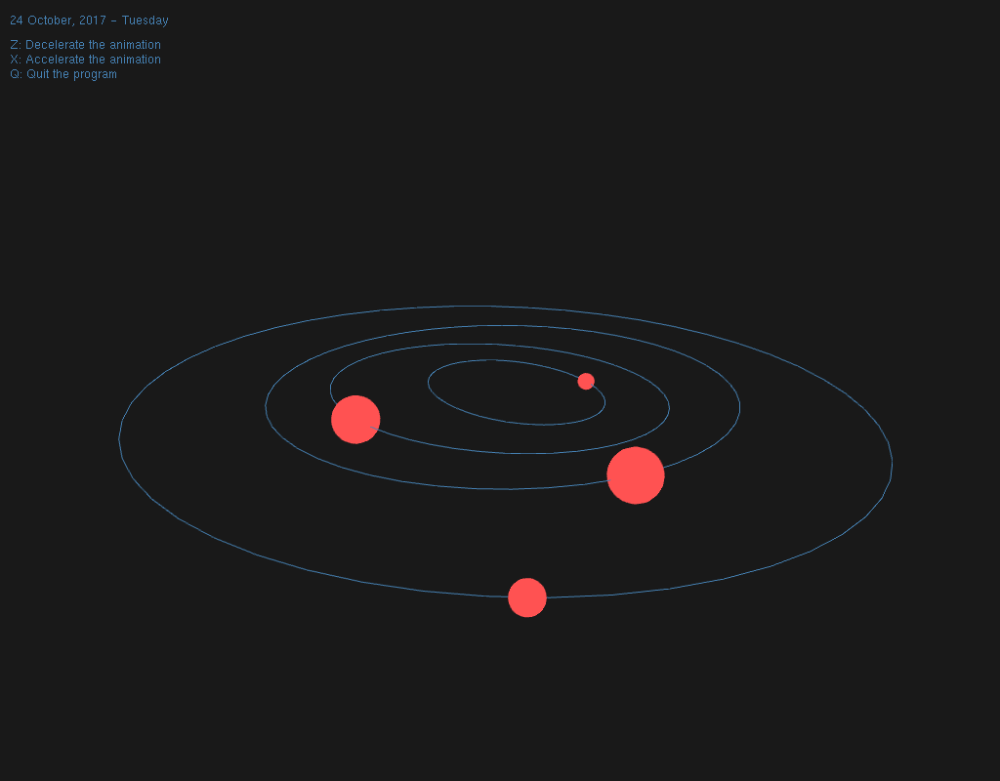

*Documentación extraída del repositorio de Github [agarciamontoro/kepler_laws](https://github.com/agarciamontoro/kepler_laws).*

# Descarga e instalación
## Dependencias
Para la correcta ejecución del programa, el sistema sobre el que se instale necesita tener las siguientes dependencias:

* OpenGL (con freeGLUT)
* SciPy
* wxPython

La mayoría de las distribuciones de Linux tienen estos paquetes en sus repositorios oficiales.

En **Ubuntu**, por ejemplo, la siguiente orden es suficiente para instalar todo lo necesario:

```
sudo apt-get install python-opengl freeglut3 python-scipy python-wxgtk2.8
```

En **Arch Linux** es muy parecido:

```
pacaur -S python-opengl freeglut python-scipy wxpython
```

## Descarga del programa
Usa el siguiente enlace para descargar todos los ficheros del programa (incluida esta documentación) en tu ordenador:

[kepler_laws-master.zip](https://github.com/agarciamontoro/kepler_laws/archive/master.zip)

Una vez descargado, descomprímelo y abre una terminal en la carpeta donde se encuentren todos los archivos.

# Uso

Para comenzar el programa, basta con ejecutar la siguiente orden desde la terminal:

```
python2 main.py
```

## Controles

Se puede rotar la escena haciendo click con el ratón en cualquier lugar de la imagen y moviéndolo. Además, se puede controlar el zoom con la rueda.

Para controlar la velocidad de la animación -que por defecto se comporta de manera que por cada segundo de la vida real transcurra un día en la simulación- se usan las siguientes teclas:

* **X**: Acelera un paso la animación; es decir, añade un día de la simulación por cada segundo de la vida real.
* **Z**: Decelera un paso la animación. Se puede usar repetidamente esta tecla para revertir el tiempo.

Para terminar el programa, pulsar la tecla **Q** o cerrar la ventana de la simulación.

La interfaz gráfica que se muestra junto a la ventana de la animación permite:

* Seleccionar los planetas cuya órbita se desea visualizar.
* Trasladar la fecha de la animación a un día concreto y mostrar la información relevante de cada planeta marcado.
* Introducir un ángulo en radianes, seleccionar un planeta, y calcular la fecha en la que su anomalía excéntrica coincide con el ángulo introducido.

-----------------------------------------------------------------

# Descripción del trabajo
Para ver esta información y una descripción detallada del trabajo, consultar el archivo [Documentacion.pdf](https://github.com/agarciamontoro/kepler_laws/blob/master/Documentacion.pdf).
